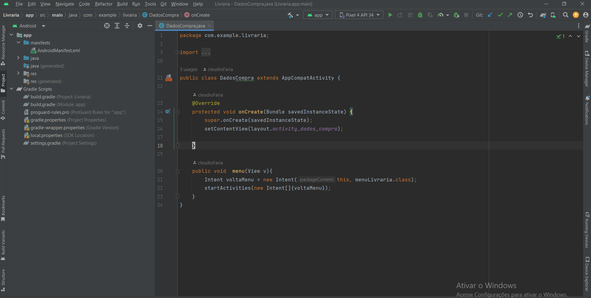
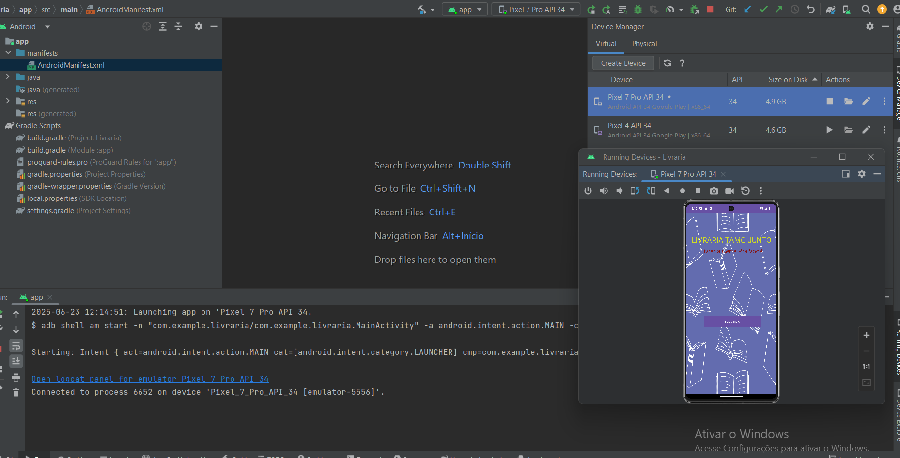
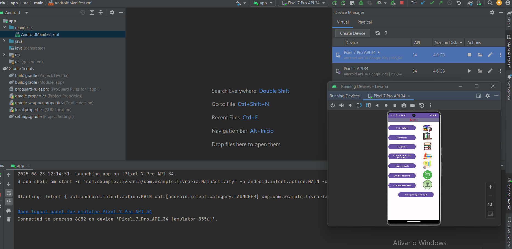

# 📚 Livraria Android

Um aplicativo Android para gerenciamento de uma livraria, permitindo o cadastro, busca e venda de livros.

# 🚀 Funcionalidades

📖 Cadastro de livros com título, autor e preço

🔍 Pesquisa de livros por nome ou categoria

🛒 Gerenciamento de vendas e estoque

📊 Relatórios de vendas e produtos disponíveis

# 🛠️ Tecnologias Utilizadas

Android 📱 (Desenvolvimento do app)

Kotlin 📝 (Linguagem de programação)

Firebase 🔥 (Banco de dados em nuvem e autenticação)

SQLite 🗄️ (Banco de dados local)

Material Design 🎨 (Interface moderna e intuitiva)

Jetpack Compose 🚀 (Desenvolvimento de UI declarativa)

# 📦 Instalação

Clone o repositório:

git clone https://github.com/cleudioFaria/livraria-_Android.git

Abra o projeto no Android Studio

Construa e execute no emulador ou dispositivo físico

# 🤝 Contribuição

Sinta-se à vontade para contribuir! Faça um fork do projeto, crie uma branch, implemente sua funcionalidade e abra um pull request.

# Imagem do Android 📚 Livraria Android

---

---

---

# 📜 Licença

Este projeto está sob a licença MIT. Sinta-se à vontade para utilizá-lo e melhorá-lo!

Feito com ❤️ por  Cleudio de Faria
